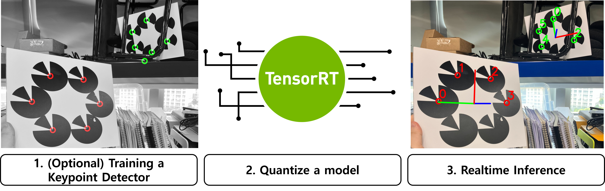

# PACMAN: Rapid Identification of Keypoint Patch-Based Fiducial Marker in Occluded Environments

Official implementation of **PACMAN**.  
- **Update (2025-11-19):** Initial release.

---

## Prerequisite

PACMAN includes optimized C++ code that uses TensorRT for real-time inference, so a specialized environment is required.  
PACMAN has been tested on the following systems:

| Computer | OS            | TensorRT Version | Pytorch Version |
|----------|---------------|------------------|-----------------|
| Desktop  | Ubuntu 22.04  | (fill)           | (fill)          |
| AGX Orin | JetPack 6.1   | (fill)           | (fill)          |



To run PACMAN, **you must quantize the NN model on your own GPU** to generate a TensorRT-compatible engine. We provide a pretrained keypoint detector network.
(See)

---

## How To Run  
(To be updated)

---

## Citation
If you find our work useful, please cite the following paper.

```
@article{PARK2026105821,
  title={PACMAN: Rapid identification of keypoint patch-based fiducial marker in occluded environments},
  journal={Image and Vision Computing},
  volume={165},
  pages={105821},
  year={2026},
  issn={0262-8856},
  doi={10.1016/j.imavis.2025.105821},
  url={https://www.sciencedirect.com/science/article/pii/S0262885625004093},
  author={Taewook Park and Geunsik Bae and Woojae Shin and Meraj Mammadov and Jaemin Seo and Heejung Shin and Hyondong Oh},
  keywords={Fiducial markers, Deep neural network, Marker detection, CNNs},
}

